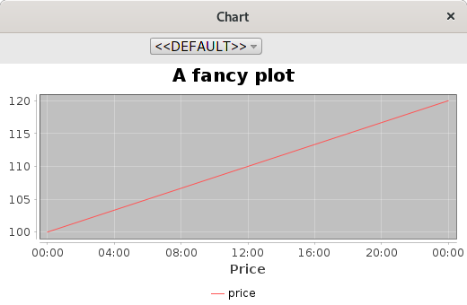
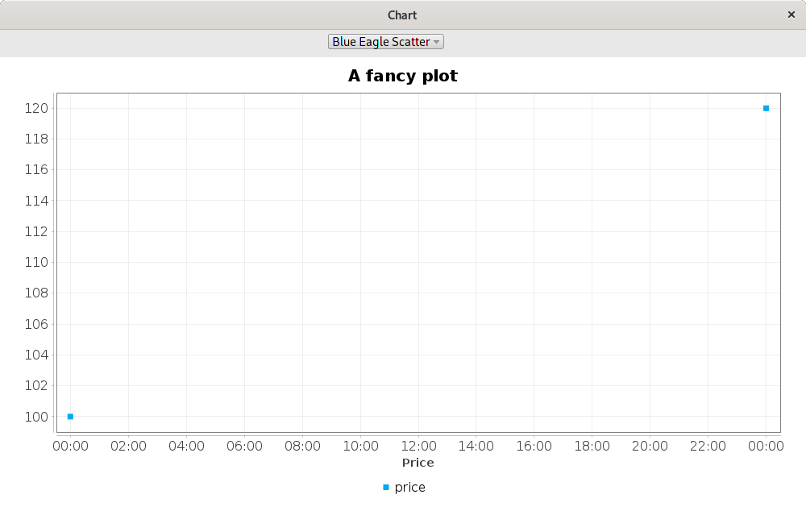
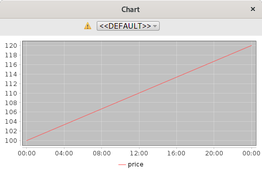
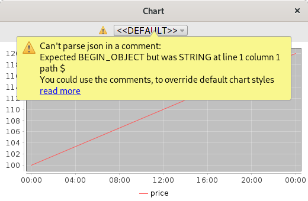

#Plot configuration override

It is possible to override some fields in the JSON configuration of the graph from the comments text executed when the table prepared.

For example, it is possible to specify

```
// {"title": {"text": "A fancy plot", "font": {"size": 20}}, "domainAxis": {"label": { "show": true, "text": Price"}}}
([] date: 2020.04.05 2020.04.06; price: 100 120)
```

when send both of those lines with "execute selected or current line", the plugin parses the JSON and remembers it.
When created a plot with this particular table output, it overlays new JSON from the comment on top of the current JSON specified in the settings for this graph.


Multiline comments with JSON are also handled, for example:
```
// {"title": {"text": "A fancy plot", "font": {"size": 20}},
//     "domainAxis": {"label”:
//          { "show": true, "text": "Price"}}}
([] date: 2020.04.05 2020.04.06; price: 100 120)
```

OR 

```
/
{"title": {"text": "A fancy plot", "font": {"size": 20}},
     "domainAxis": {"label”:
          { "show": true, "text": "Price"}}}
\
([] date: 2020.04.05 2020.04.06; price: 100 120)
```

The overridden config still applied if user changes the graph style (for example, moving from a line based chart to a scatterplot).
 

If there are problems with the JSON format, a warning icon would be displayed in the plot window. 


Clicking on that warning icon, user is able to see which errors happened.
