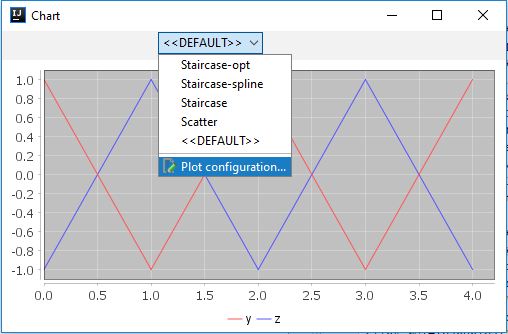
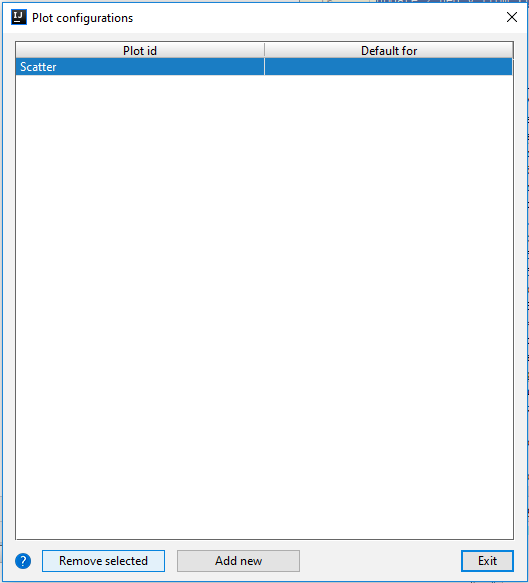
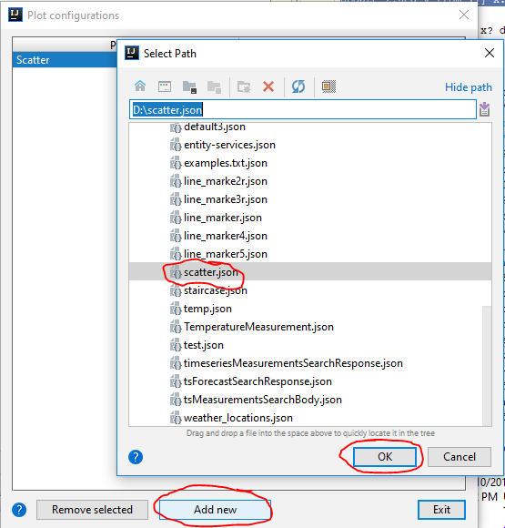
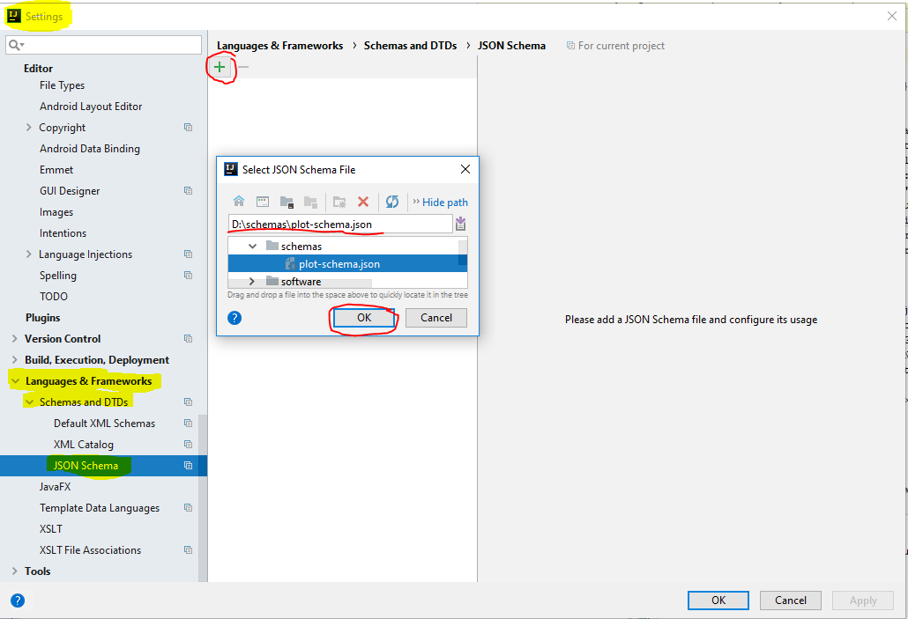
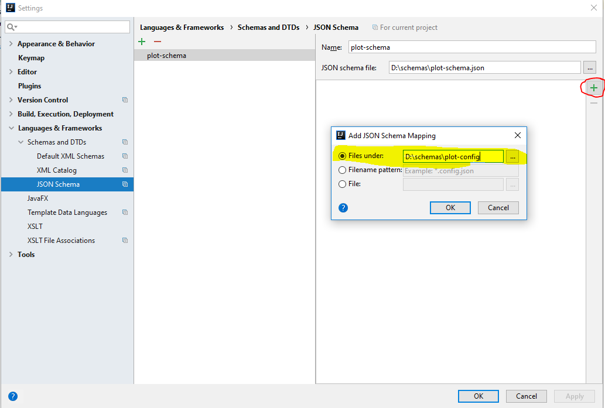
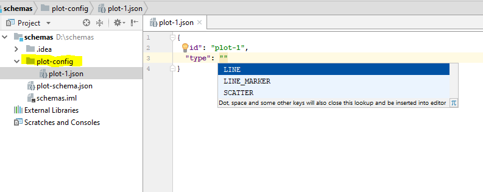
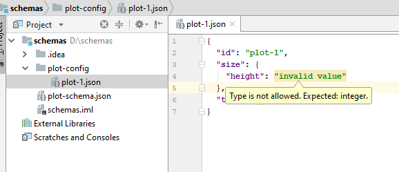

# Plot configuration

In order to customize chart look and feel, you should create a configuration file.

You could open chart configuration window from the chart window, by selecting last item in the available configurations list:

In opened window, you are able to manage all existing configurations: apply default config to each chart type, remove configuration or add a new one:

     
 
 To add new configuration, you should select json file, which corresponds to the json schema, available in [project sources](https://gitlab.com/shupakabras/kdb-intellij-plugin/raw/master/resources/plot-schema.json). There are several sample configurations available in the [same folder](https://gitlab.com/shupakabras/kdb-intellij-plugin/raw/master/resources/): blue-eagle-lines.json, blue-eagle-scatter.json and first-class-lines.json.
 

## Configure Intellij IDEA for json schema validation. 

You could also configure IDEA to validate json file through the JSON schema.

First, download the [latest schema](https://gitlab.com/shupakabras/kdb-intellij-plugin/raw/master/resources/plot-schema.json) from sources repo, and save it somewhere under IDEA project root.

Now open Settings window, and search for Languages & Frameworks -> Schemas and DTDs -> JSON Schema

Click on "Plus" icon and select the plot-schema.json file.

Now you are able to add files which should be validated against the schema. So you could specify single file, or a directory: 

And now, all your files under the specified directory would be validated be IDEA. So you could have inline suggestions:

Or validation warnings: 

