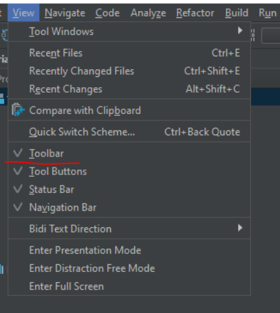
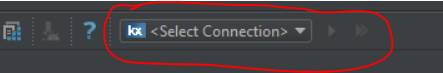
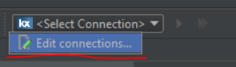
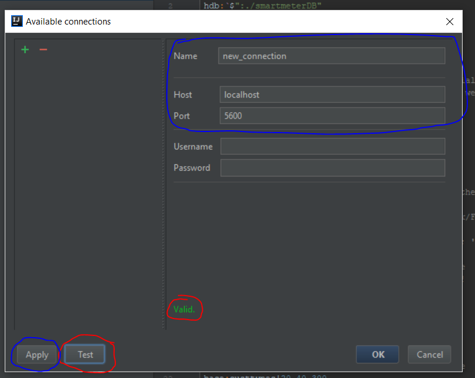
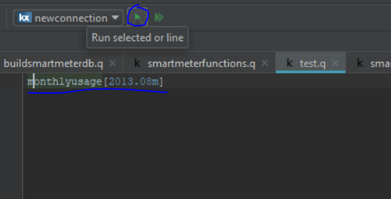
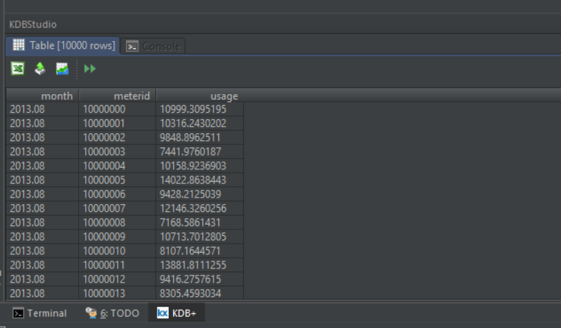

# KDB+ Studio plugin for Intellij IDEA

### Usage instruction

 1. Make sure toolbar view is enabled 
 
 2. Find KDB+ Studio action group
 
 3. Click on menu and choose edit connections
 
 4. In opened editor window, fill required fields (name, host and port) and click Apply or Ok button
  You could also click on Test button, in order to verify connection settings
   
 5. In opened editor type some query, and push on Run selected or line button
 
 6. Verify results appears
  