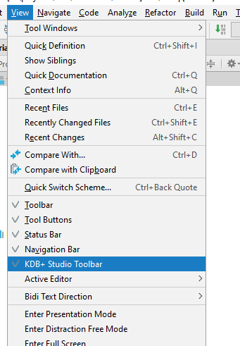
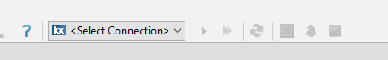
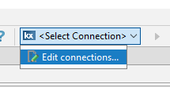
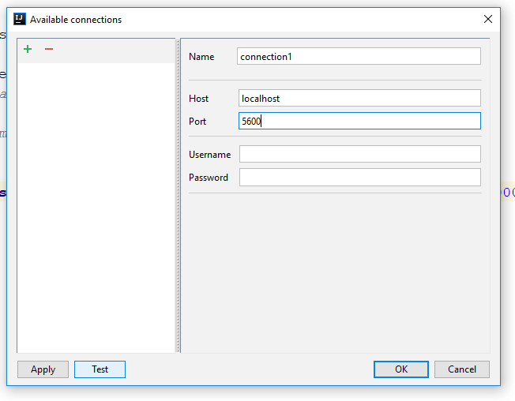
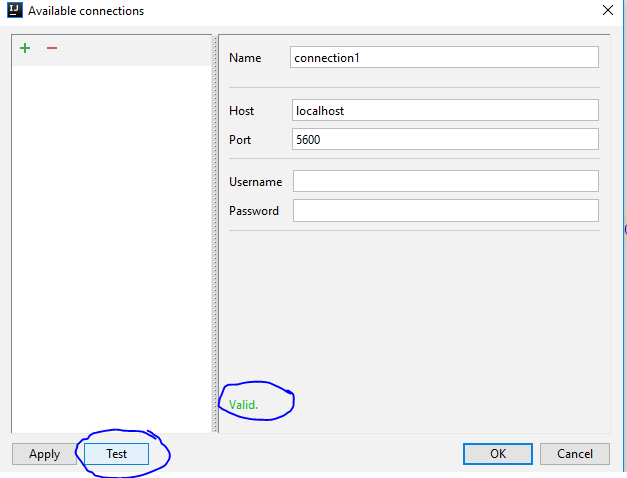
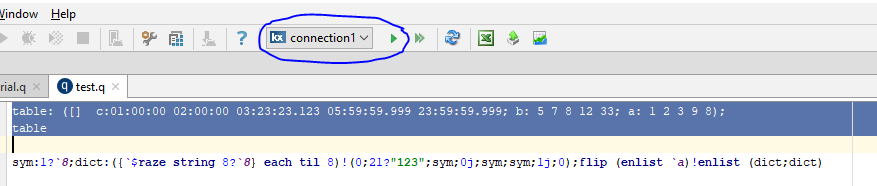
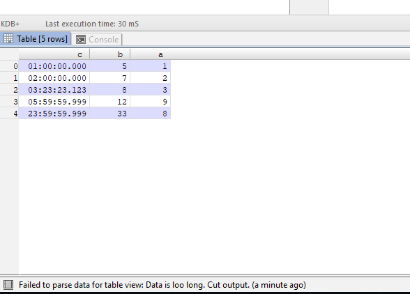
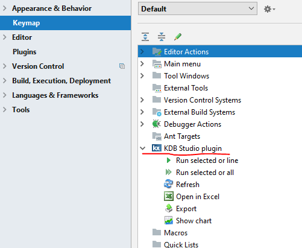
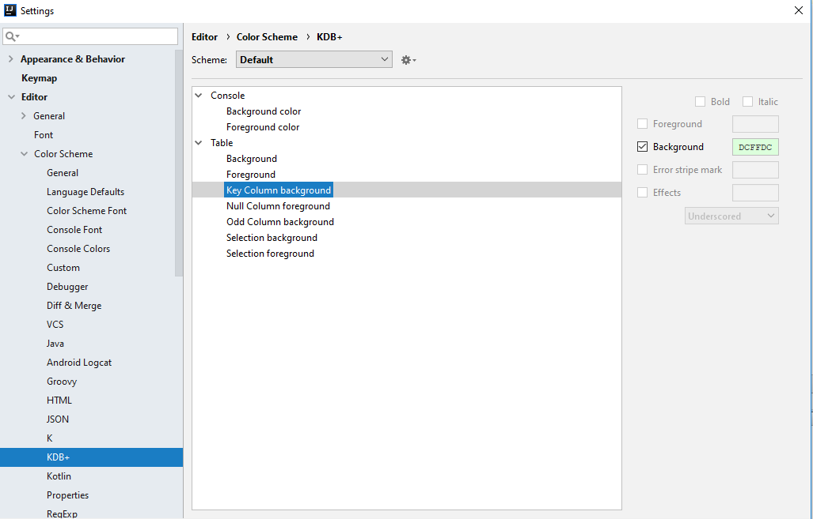

# KDB+ Studio plugin for Intellij IDEA

### Usage instruction

#### Toolbar visibility 
 To control KDB+ Studio Toolbar visibility, use corresponded submenu in View menu:
  
 
 Also note, disabling View->Toolbar will also hide Studio Toolbar

#### Toolbar action group   
 Once you enabled Studio Toolbar, it would appeared inside of IDE view toolbar
 

#### Connection management
 In order to execute any request, you need to setup at least one active connection.
 
 On <Select connection> combo choose Edit connections... submenu
 
 
 
 In opened editor window, fill all required fields (name, host and port) and click Apply or Ok button.
 
 
 
 You could also click on Test button, in order to verify connection settings.
 
 
 
#### Execute query
 In opened editor, type a query and push on Run selected or line button
 
 
 
 Verify the results appears
 
 
 
#### Plugin settings
 
 To control actions keymap, choose File -> Settings. Find KDB Studio Plugin in Keymap section
 
 
 
 To control plugin color and styling, choose File -> Settings. Find KDB+ in Editor -> Color Scheme section
 
 
 
 To control plugin font, you may use standard Editor -> Font section.
   